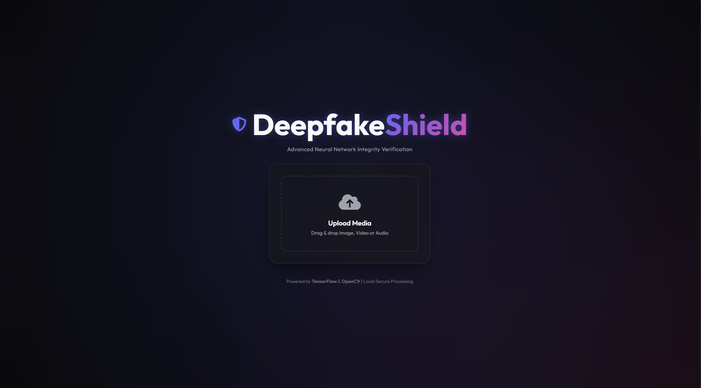
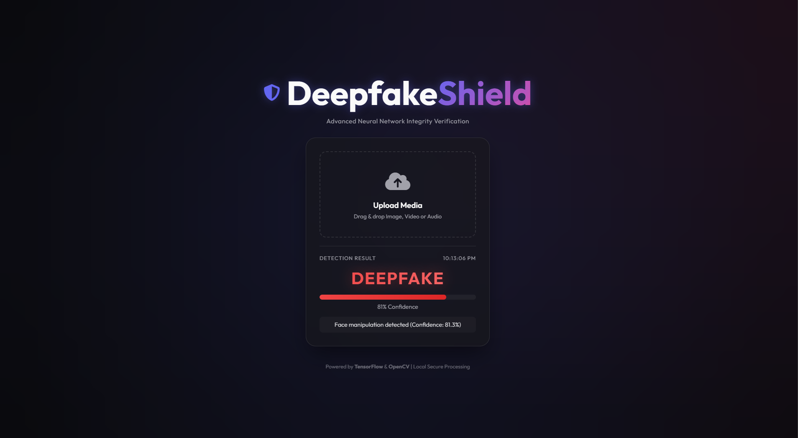

Deepfake Detection Project

## Overview

This project detects deepfake content using image, video, and audio inputs using machine learning.

## Project Interface

### 1. Main Interface

*The clean and modern upload interface supporting multi-format media analysis.*

### 2. Deepfake Detection Result

*Detailed analysis report highlighting detection confidence and manipulation type.*

## Features

* Image deepfake detection
* Video deepfake detection
* Audio analysis
* Pre-trained models included

## Technologies

* **Backend:** Python, Flask
* **AI/ML:** TensorFlow, Keras, OpenCV
* **Frontend:** HTML5, CSS3 (Modern Dark UI)

## How to Run

1. **Install Dependencies:**
   ```bash
   pip install -r requirements.txt
   ```
2. **Launch Application:**
   ```bash
   python app.py
   ```
3. **Access UI:** Open `http://127.0.0.1:8080/` in your browser.

> [!NOTE]
> Dataset is not included in this repository due to its large size.

## Future Improvements

* **Real-Time Detection:** Live prediction using webcam feed.
* **Advanced Models:** Implementation of state-of-the-art architectures for higher accuracy.
* **Explainable AI:** Heatmap generation for result visualization.
* **API Integration:** RESTful API for third-party service integration.
* **Deployment:** Cloud hosting for global accessibility.
